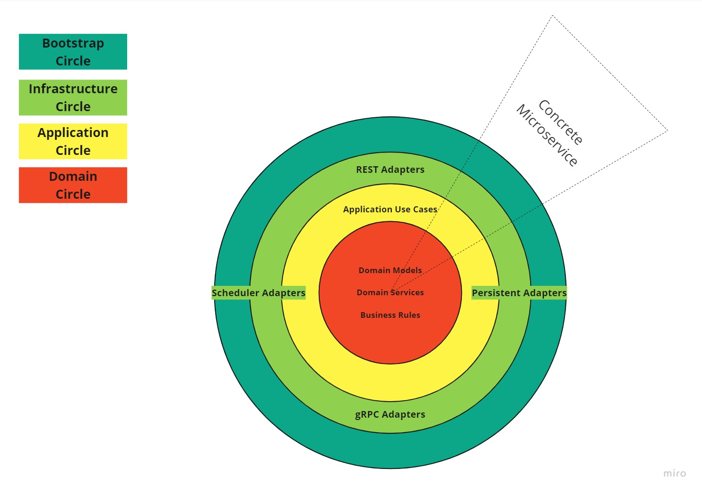
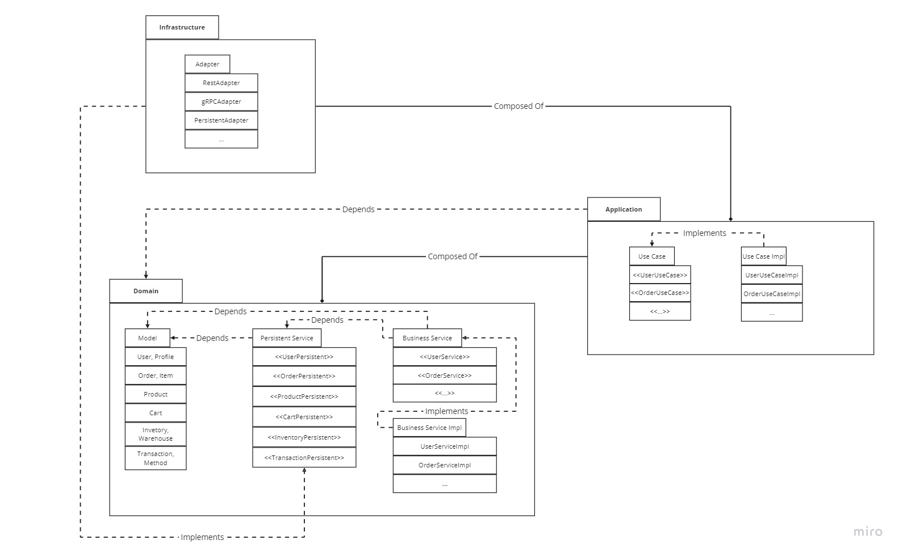

# Architecture
Architecture based on [requirements](./Requirements.md).

## Microservice Architecture

### Motivation
The Microservice architectural style is an approach to developing 
a single application as a suite of small services, 
each running in its own process and communicating 
with lightweight mechanisms, often an HTTP or gRPC API.

One of major benefits is ability to be deployed autonomously / independently for each small service.

Proper designed microservice is able to easy scale up/down on needs.

Strengthening the knowledge and skills on Microservice Architecture 
and dealing with increased complexity of Microservices in action.

### Diagram

### Services
As a part of scaling strategy services could be divided,
but for sake of simplicity it leaves as it is.

#### Ecommerce User Management Service (EUMS)
This service is responsible for user registration, login, profile management, and authentication.

#### Ecommerce Product Catalog Service (EPCS)
Manages product information, including listings, descriptions, images, and pricing.

#### Ecommerce Order Management Service (EOMS)
Manages the order lifecycle, including order creation, payment processing, order fulfillment, and tracking.

#### Ecommerce Payment Gateway Service (EPGS)
Handles payment processing, including payment methods, authorization, and transaction management.

#### Ecommerce Shopping Cart Service (ESCS)
Handles user shopping carts, including adding/removing items, calculating totals, and storing cart state.

#### Ecommerce Inventory Management Service (EIMS)
Manages product stock levels, tracks inventory, and updates the Product Catalog service with availability information.

### Microservice Patterns in Code

#### Api Gateway

#### Database per Service

#### Circuit Breaker

#### Distributed Tracing

## Onion Architecture

### Motivation
Onion architecture implements Domain-driven Design (DDD) concept 
and dramatically increases code quality, reduces complexity and enables evolutionary enterprise systems.

The Onion architecture is build on a domain model in which layers are connected through interfaces.

The idea is to keep external dependencies (e.g. Spring Framework) as far outward as possible 
to make easier switching to a new framework or technology 
and as result making business logic independent on technologies were used.

Strengthening the knowledge and skills on Domain-driven Design (DDD) and Onion Architecture in action.

### Diagram

### Core concepts
`The circles` represent different layers of responsibility. The outer circles represent mechanism, and the inner circles represent core domain logic.

`The adapters` represent entry-point to the entire application, e.g. REST, gRPC and so on. 
It handles incoming requests (e.g. Web API) or outgoing requests (e.g. Persistence).

`The use cases` represent specific functionality, e.g. Create Order, 
which depends on multiple business rules like `validate order`, `calculate tax`, `persist order`, `notify`, and so on.

---

`The Domain Model Circle` defines the fundamental building block of Domain-Driven Design. 
It is supposed to be independent of specific technologies like database, or web apis.

`The Domain Service Circle` defines the interfaces to manipulate domain logic and business rules, 
and to be propagated to outer circles.

`The Application Service Circle` defines the interfaces to manipulate the Use Cases, 
and orchestrates the Domain Service Circle.

`The Infastructure Service Circle` exposes the Adapters to interact with the external world, 
and orchestrates the Application Service Circle.

### Representation in Code
`The Domain Model Circle` and `The Domain Service Circle` represents the package `domain`. 
These circles were merged for sake of simplicity, because this project was not intended to evolve.

`The Application Circle` represents the package `application`.

`The Infrastructure Circle` represents the package `infrastructure`.

## Specification Driven Development (SDD)
Specification-driven API development is a design-first approach to software development.

In a spec-driven development process, the development team starts with the API specification before writing any code.

This method is designed to help development teams build sensible and efficient APIs. 
This approach allows developers to define the structure and behavior of their API before any implementation takes place.

The stages of SDD:
- Designing the API : considering the needs of application, ways of communication (e.g. events, rpc, http), external and internal communication, versioning of api 

- Writing Specification : write clear contracts using yaml, json, or interfaces

- Validation of Specification

- Implementation of Specification

The `specification` folder represents all contracts to be implemented.

Were chosen the java interface option to define contract for sake of simplicity.

## Database Decisions
See [docs](./Database.md).

## Communication Decisions
See [docs](./Communication.md).
